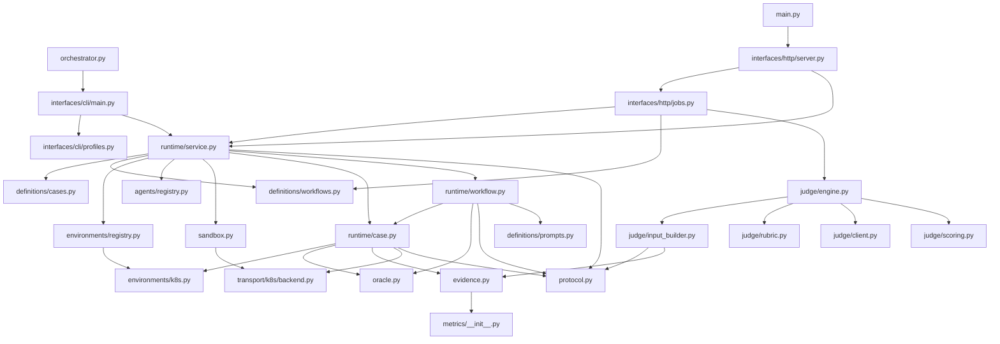

# KARMA Full Refactor Plan v3

## Summary
- Rebuild KARMA around one package-level runtime core used by both CLI and UI.
- Keep only two top-level user entrypoints: `orchestrator.py` and `main.py`. Remove root `proxy.py` in the target state.
- Eliminate generic junk-drawer modules: no repo-wide `common.py`, no repo-wide `models.py`.
- Prefer colocation: helpers and types live with the subsystem that owns them. Only extract shared code when it is a real cross-subsystem contract.
- Target Python control-plane/runtime size: about `11k-13.5k` LOC, down from the current ~`18.5k` LOC. Expected reduction: about `5k-7.5k` LOC if legacy glue is actually deleted.

## Target Structure
```text
/
├── orchestrator.py
├── main.py
├── static/
└── karma/
    ├── definitions/
    │   ├── __init__.py
    │   ├── cases.py
    │   ├── workflows.py
    │   └── prompts.py
    ├── environments/
    │   ├── __init__.py
    │   ├── registry.py
    │   └── k8s.py
    ├── agents/
    │   ├── __init__.py
    │   ├── registry.py
    │   ├── react/
    │   │   ├── Dockerfile
    │   │   ├── entrypoint.sh
    │   │   ├── README.md
    │   │   └── agent-local helpers if needed
    │   └── cli_runner/
    │       ├── Dockerfile
    │       ├── entrypoint.sh
    │       ├── README.md
    │       ├── system_prompt.txt
    │       └── agent-local helpers if needed
    ├── sandbox.py
    ├── runtime/
    │   ├── __init__.py
    │   ├── service.py
    │   ├── case.py
    │   └── workflow.py
    ├── oracle.py
    ├── transport/
    │   ├── __init__.py
    │   └── k8s/
    │       ├── __init__.py
    │       ├── backend.py
    │       └── proxy.py
    ├── protocol.py
    ├── evidence.py
    ├── metrics/
    │   ├── __init__.py
    │   └── *.py
    ├── judge/
    │   ├── __init__.py
    │   ├── engine.py
    │   ├── input_builder.py
    │   ├── rubric.py
    │   ├── client.py
    │   └── scoring.py
    └── interfaces/
        ├── __init__.py
        ├── cli/
        │   ├── __init__.py
        │   ├── main.py
        │   └── profiles.py
        └── http/
            ├── __init__.py
            ├── server.py
            └── jobs.py
```

## File Responsibilities And LOC Targets
| File | Responsibility | Est. LOC |
|---|---|---:|
| `orchestrator.py` | Zero-logic shim to CLI adapter | 10-20 |
| `main.py` | Zero-logic shim to HTTP adapter | 10-20 |
| `definitions/cases.py` | Case loading, schema validation, params, preconditions, namespace contract parsing, oracle config normalization | 450-600 |
| `definitions/workflows.py` | Workflow loading, stage resolution, namespace alias handling, single-case -> 1-stage workflow builder | 450-650 |
| `definitions/prompts.py` | Prompt rendering and placeholder expansion | 220-320 |
| `environments/registry.py` | Provider lookup and environment selection | 60-100 |
| `environments/k8s.py` | Kubernetes execution context, namespace binding, manifest rendering, ensure/cleanup, env injection | 500-700 |
| `agents/registry.py` | Built-in agent lookup, folder path resolution, launch metadata wiring | 80-140 |
| `sandbox.py` | Local vs Docker launch, container/process lifecycle, auth/workspace mounts, terminate/cleanup | 300-450 |
| `runtime/service.py` | Public runtime API for adapters: `run_case`, `run_workflow`, `submit_run`, `cleanup_run`, `get_run_status` | 260-360 |
| `runtime/case.py` | Single-stage lifecycle: setup, probe/apply/verify, submit loop, verify, cleanup, timeout handling | 550-750 |
| `runtime/workflow.py` | Workflow loop, retries, stage advance, state publication, final sweep, workflow cleanup | 700-900 |
| `oracle.py` | Canonical oracle execution and final regression sweep helpers | 180-260 |
| `transport/k8s/backend.py` | Public K8s transport API: launch proxy subprocess, wait for readiness, build agent kube access bundle | 180-280 |
| `transport/k8s/proxy.py` | Standalone proxy daemon and control/status API, `if __name__ == "__main__"` entrypoint, random-port bind | 220-320 |
| `protocol.py` | Run-dir contract, prompt files, submit files, workflow state files, bundle layout, artifact path helpers | 380-520 |
| `evidence.py` | Snapshot collection, usage normalization, trace facts, metric orchestration | 220-320 |
| `metrics/__init__.py` | Metric registry and dispatch | 40-70 |
| `metrics/*.py` | Leaf metric plugins | 1,800-2,300 total |
| `judge/engine.py` | Judge orchestration and result writes | 350-450 |
| `judge/input_builder.py` | Assemble judge request from artifacts and evidence | 350-450 |
| `judge/rubric.py` | Rubric loading and override logic | 450-550 |
| `judge/client.py` | OpenAI-compatible client | 120-170 |
| `judge/scoring.py` | Score aggregation and evidence validation | 250-350 |
| `interfaces/cli/main.py` | CLI parsing, request normalization, result output | 350-450 |
| `interfaces/cli/profiles.py` | Profile/default loading and merge | 180-240 |
| `interfaces/http/server.py` | HTTP routes, SSE, static serving, thin backend layer | 350-450 |
| `interfaces/http/jobs.py` | UI job state, single-case -> 1-stage workflow translation, job orchestration | 420-560 |

## Architectural Rules
- `runtime/*` is the only execution core. CLI and HTTP call it; they do not implement orchestration themselves.
- No repo-wide `common.py` or `models.py`.
- Types live where they are owned. If a shared type is needed, use a subsystem-local `types.py`, not a generic global file.
- Agent implementations are fully isolated by folder. The only shared agent code is `agents/registry.py`.
- No agent `base.py`, no shared agent manifest type, no shared agent helper layer by default.
- `transport/k8s/backend.py` is the only K8s transport file imported by the rest of KARMA.
- `transport/k8s/proxy.py` owns the daemon process and its `__main__` entrypoint.
- Root `proxy.py` is removed. Canonical manual debug command is `python -m karma.transport.k8s.proxy`.
- `sandbox.py` stays one file until there is a real third backend or major lifecycle divergence.
- `judge/*` must not import `runtime/*`.
- Metrics stay separate from judge. Judge consumes evidence and metrics; it does not compute or own them.
- Single-case UI runs are normalized in `interfaces/http/jobs.py` into a 1-stage workflow and then run through the same runtime path as normal workflows.

## Public Interfaces
- `orchestrator.py` remains the CLI entrypoint, but only forwards to `interfaces/cli/main.py`.
- `main.py` remains the UI backend entrypoint, but only forwards to `interfaces/http/server.py`.
- New internal canonical runtime API is `runtime/service.py`.
- New internal canonical K8s transport API is `transport/k8s/backend.py`.
- Agent registration is explicit in `agents/registry.py`; contributors add a new agent by adding a folder and updating the registry.

## Dependency Graph


## Migration Plan
1. Create `karma/definitions`, `karma/environments`, `karma/runtime`, `karma/interfaces`, `karma/transport/k8s`, and `karma/agents`.
2. Move case/workflow/prompt logic first, because those are stable definitions and unblock the rest of the cutover.
3. Build `runtime/service.py`, `runtime/case.py`, and `runtime/workflow.py` as the new execution spine while keeping current behavior stable.
4. Move CLI and HTTP adapters onto the new runtime API.
5. Move K8s proxy code into `transport/k8s/backend.py` and `transport/k8s/proxy.py`, then remove root `proxy.py`.
6. Move agent assets into `agents/<agent>/` folders and replace current wiring with `agents/registry.py`.
7. Once parity is proven, delete the old wrapper/glue modules instead of keeping compatibility layers.

## Test Plan
- Unit tests for case/workflow parsing, param resolution, namespace contract validation, and prompt rendering.
- Unit tests for `runtime/case.py`: setup success/failure, submit loop, verify failure, cleanup behavior.
- Unit tests for `runtime/workflow.py`: retry, stage advance, terminate, final sweep, and next-stage-setup failure.
- Unit tests for `transport/k8s/backend.py`: proxy startup handshake, random-port contract, readiness timeout, teardown.
- Unit tests for `interfaces/http/jobs.py`: single-case UI requests normalize to a 1-stage workflow with stable semantics.
- Unit tests for `agents/registry.py`: agent lookup and folder resolution.
- Regression tests proving CLI-triggered and UI-triggered runs both use the same runtime service.
- Golden-path smoke test for the demo workflow proving artifact compatibility.
- Judge tests proving `judge/*` runs entirely from artifacts and evidence without runtime imports.

## Assumptions
- Wave 1 preserves current CLI commands, UI flows, and artifact contracts unless a break is explicitly approved.
- Kubernetes is the only real environment provider in phase 1, but the provider boundary is created now for future non-Kubernetes targets.
- Docker and local are the only launch backends in phase 1, so `sandbox.py` stays consolidated.
- K8s transport gets exactly two Python files now: `backend.py` and `proxy.py`.
- Metric plugins remain mostly as-is because they are not the primary maintainability bottleneck.
