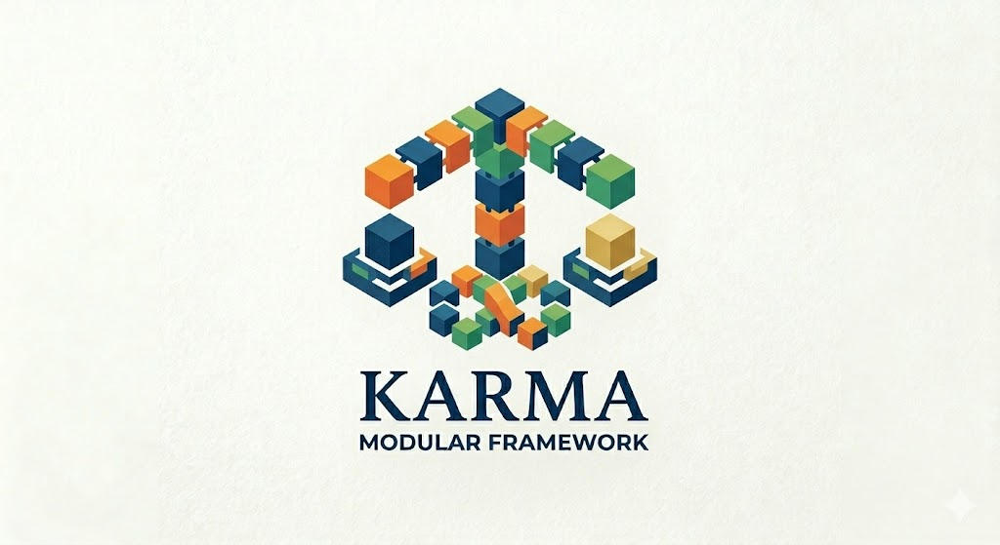

<div align="center">

<p align="center">
  
</p>

# KARMA

**Kubernetes Agent Runtime Measurement Architecture**

Composable evaluation for AI agents working on live Kubernetes systems.

<p align="center">
  <a href="#about"><b>About</b></a> |
  <a href="#why-karma"><b>Why KARMA</b></a> |
  <a href="#quick-start"><b>Quick Start</b></a> |
  <a href="#repo-map"><b>Repo Map</b></a> |
  <a href="#profiles"><b>Profiles</b></a> |
  <a href="#roadmap"><b>Roadmap</b></a> |
  <a href="#developer-guide"><b>Developer Guide</b></a>
</p>

</div>

## About

KARMA is a framework for evaluating AI agents on realistic Kubernetes operations tasks.

Instead of treating each benchmark as a one-off script, KARMA models tasks as reusable stages that can be assembled into multi-stage workflows. Each stage prepares the environment, lets the agent act on the live system, verifies the result, and records artifacts for later analysis.

The point is simple: isolated tasks only tell part of the story. Real operations work is stateful. Changes stack up. Fixes in one step can quietly break something earlier. KARMA is built to evaluate agents in that setting.

Today the repo includes workflow-ready cases across RabbitMQ, MongoDB, CockroachDB, Elasticsearch, Nginx, Ray, and Spark.

## Why KARMA

KARMA is built around a few ideas that matter in practice:

- **Reusable building blocks.** A testcase defines one operational task with setup, prompt, verification, cleanup, and metrics.
- **Stateful workflows.** Stages run in sequence against preserved system state, so later actions can help or hurt earlier outcomes.
- **Deterministic correctness checks.** Each stage has explicit verification, with optional workflow-level regression sweeps to catch cross-stage breakage.
- **Probe/apply/verify setup.** Preconditions are resolved against the live cluster instead of assuming a clean reset every time.
- **Trajectory capture.** Runs produce logs, traces, snapshots, and optional judge artifacts so you can inspect how the agent behaved, not just whether it passed.

This makes KARMA useful for long-horizon evaluation, regression analysis, and safety-oriented agent testing in real infrastructure environments.

## Quick Start

Install dependencies and start the web UI:

```bash
pip install -r requirements.txt
python3 main.py
```

Then open:

```text
http://localhost:8080
```

The UI is the easiest way to browse services, inspect workflows, and generate equivalent CLI commands.

If you want a local cluster for development, bootstrap a Kind environment with:

```bash
./scripts/setup-cluster.sh --provider kind
```

Run a sample workflow from the CLI:

```bash
python3 orchestrator.py workflow-run \
  --workflow workflows/workflow-demo.yaml
```

Run the same workflow with a checked-in profile:

```bash
python3 orchestrator.py workflow-run \
  --profile profiles/debug.yaml \
  --workflow workflows/workflow-demo.yaml
```

Run tests:

```bash
python3 tests/run_unit.py
python3 tests/run_integration.py
```

## Repo Map

- `main.py`
  Starts the local web UI.

- `orchestrator.py`
  Headless CLI entrypoint for `run`, `batch`, and `workflow-run`.

- `app/`
  Core runtime code, including the workflow engine, agent runtime, judge pipeline, and UI job machinery.

- `resources/`
  Benchmark corpus. Each testcase lives under `resources/<service>/<case>/test.yaml`.

- `workflows/`
  Multi-stage workflow definitions built from reusable testcases.

- `agent_tests/`
  Agent container definitions and wrappers such as `react` and `cli-runner`.

- `profiles/`
  Reusable execution presets for `orchestrator.py --profile`.

- `docs/`
  Architecture notes, design docs, and developer runbooks.

- `tests/`
  Unit and integration coverage.

## Profiles

KARMA supports reusable run profiles through `orchestrator.py --profile`.

That is the profile system used for commands like:

```bash
python3 orchestrator.py workflow-run \
  --profile profiles/codex.yaml \
  --workflow workflows/workflow-demo.yaml
```

Shipped examples:

- `profiles/debug.yaml`
  Starts a Docker workflow run with `cli-runner` held open for manual debugging.

- `profiles/codex.yaml`
  Starts a Docker workflow run with `cli-runner` and a headless Codex command.

One important naming note: this repo also has judge rubric profiles under `resources/*/judge_base.yaml`. Those are not execution presets. They are overlays for the LLM-as-Judge pipeline.

## Roadmap

KARMA already scales benchmark difficulty through workflow composition. The next steps are about widening that model.

- **Beyond Kubernetes**
  The current implementation focuses on Kubernetes microservices. The workflow model itself is broader, and we want to extend it to other environments.

- **Vertical adversarial injection**
  Workflow length is only one source of difficulty. We also want to layer controlled environmental interference onto existing workflows, including config drift, permission constraints, background controllers, and competing automation.

Together, those two directions push KARMA from longer workflows toward richer and more realistic operating conditions.

## Developer Guide

If you want to understand or extend the repo, start here:

- `docs/overview.md`
  High-level overview of the framework and runtime model.

- `docs/architecture.md`
  System architecture and execution phases.

- `docs/design/workflow-model.md`
  Workflow and stage model.

- `docs/design/workflow-agent-progress-contract.md`
  Prompt and runtime expectations for agents.

- `docs/developer/debugging-runbook.md`
  Practical debugging notes for workflow runs.

- `docs/developer/internals.md`
  Maintainer-oriented code map.

- `docs/developer/adding-a-test-case.md`
  How to author reusable, workflow-safe testcases.

If you are new to the codebase, a good path is:

1. Read `docs/overview.md`.
2. Open a workflow in `workflows/`.
3. Open a testcase in `resources/<service>/<case>/test.yaml`.
4. Trace `orchestrator.py` into `app/orchestrator_core/cli.py` and `app/orchestrator_core/workflow_engine.py`.
5. Run a workflow with `profiles/debug.yaml` and inspect the artifacts under `runs/`.
